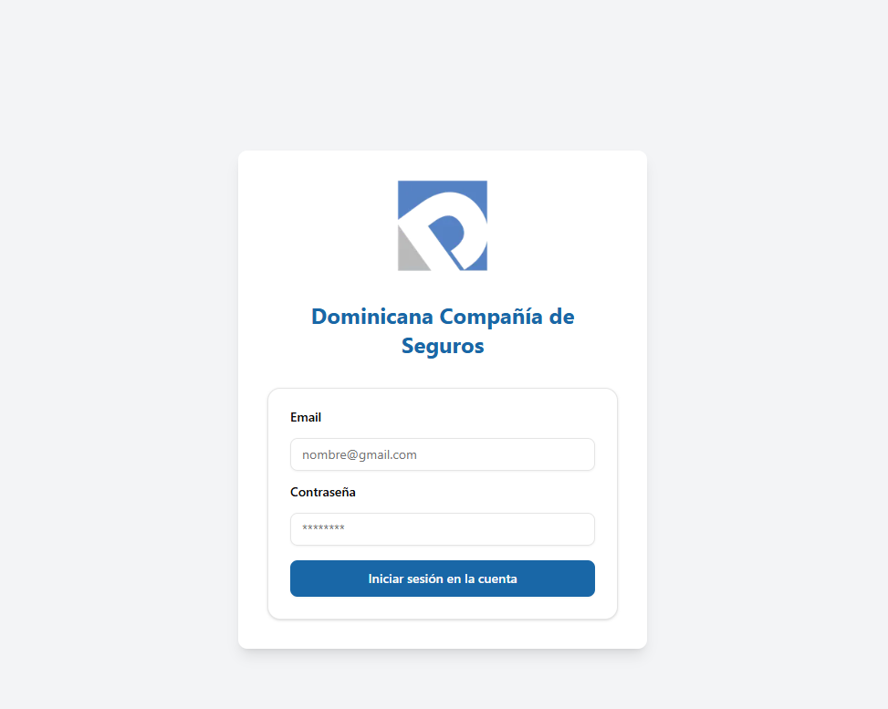
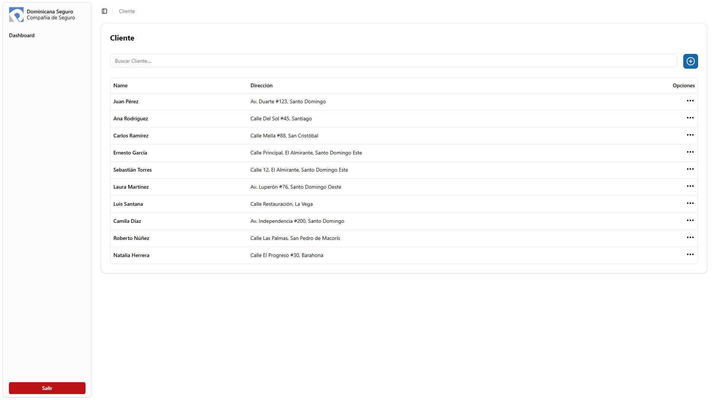
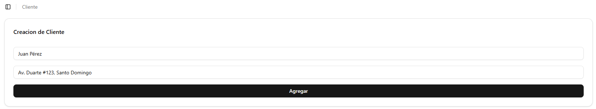

# Gestor de cliente Dominicana-seguro

En este proyecto se prodra realizar un crud en relacion a los cliente

## Características
✅ Gestión de clientes y direcciones con creación, edición y eliminación.
- ⚙️ Construido con **Next.js** y **JSON Server** para simular una API REST.
- 💾 Datos simulados persistentes en `db.json` para pruebas rápidas sin necesidad de base de datos real.
- 🎨 Interfaz con utilizando **Tailwind CSS**.

## 📸 Capturas de Pantalla

**Login**


**Dashboard**


**Modulo Creacion/Edicion**



## 🛠️ Tecnologías Usadas
- **Next.js** – Framework de React para aplicaciones web modernas con renderizado híbrido.
- **Tailwind CSS** – Framework de estilos utilitario para crear interfaces rápidas y personalizables.
- **JSON Server** – API REST simulada para pruebas locales sin necesidad de una base de datos real.
- **Shadcn/UI** – Componentes de interfaz accesibles y personalizables, basados en Radix UI.
- **Lucide React** – Colección de íconos SVG para proyectos React, simple y elegante.`

## 📁 Estructura del Proyecto

El proyecto utiliza el sistema de rutas del **App Router de Next.js**, y está organizado de la siguiente manera:

```bash
src/
└── app/
    ├── dashboard/
    │   └── customer/
    │       ├── [id]/                # Página dinámica para cada cliente
    │       │   └── page.jsx
    │       ├── layout.jsx           # Layout local
    │       ├── loading.jsx          # Indicador de carga
    │       └── page.jsx             # Lista de clientes
    ├── layout.jsx                   # Layout principal del proyecto
    ├── not-found.jsx                # Página 404
    ├── page.jsx                     # Página inicial
    ├── globals.css                  # Estilos globales
    └── favicon.ico
```    
# Instalación

Entra a la carpeta
**dominicana_seguro**

## Instala las dependencias
npm install

## Inicia el servidor
npm run dev

## Inicia el json-server
npm run server

## 📋 Funcionalidades

### 🔍 Búsqueda de clientes
En la parte superior se encuentra una barra de búsqueda para filtrar rápidamente los clientes por nombre.

### 📄 Lista de clientes
Se muestra una tabla con los siguientes campos:

- **Name:** Nombre completo del cliente.
- **Dirección:** Dirección detallada del cliente.

### ➕ Agregar cliente
El botón azul con el ícono de "+" permite registrar un nuevo cliente.

### ⚙️ Opciones por cliente
Cada fila tiene un menú desplegable (los tres puntos verticales ...) con las siguientes acciones:

- **Editar:** Abre un formulario para modificar la información del cliente.
- **Eliminar:** Elimina al cliente de la lista. 
